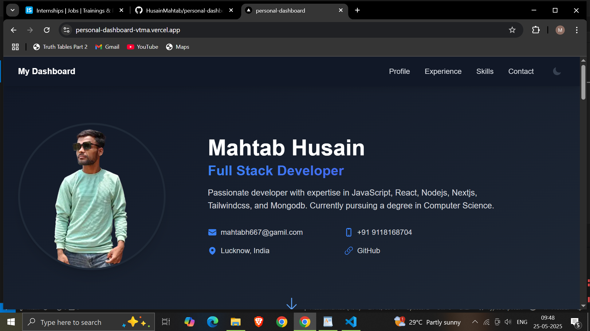

# Personal Developer Dashboard

[](https://personal-dashboard-vtma.vercel.app/)
[](https://nextjs.org/)
[](https://opensource.org/licenses/MIT)

A modern, responsive personal dashboard showcasing my developer portfolio with dark/light mode, animated transitions, and smooth scrolling.



## Features ✨

- **Dark/Light Mode Toggle** - System preference with manual override
- **Responsive Design** - Fully functional on mobile & desktop
- **Interactive Timeline** - Professional experience & education
- **Skills Visualization** - Animated proficiency bars
- **Smooth Navigation** - Section scrolling with active highlighting
- **Modern UI** - Tailwind CSS with glassmorphism effects
- **Type Safety** - Built with TypeScript

## Tech Stack 🛠️

- **Framework**: [Next.js 14](https://nextjs.org/) (App Router)
- **Styling**: [Tailwind CSS](https://tailwindcss.com/) + Dark Mode
- **Animations**: [Framer Motion](https://www.framer.com/motion/)
- **Icons**: [Heroicons](https://heroicons.com/)
- **Deployment**: [Vercel](https://vercel.com/)

## Installation 💻

1. Clone the repository:
   ```bash
   git clone (https://github.com/HusainMahtab/personal-dashboard)
